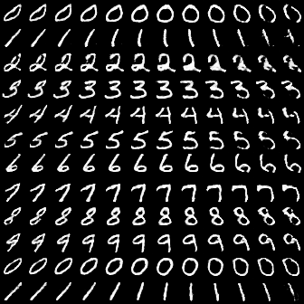
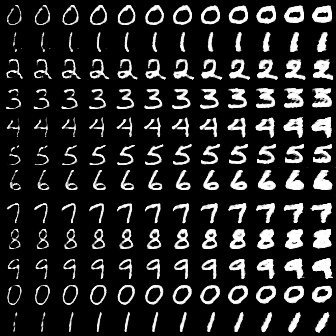
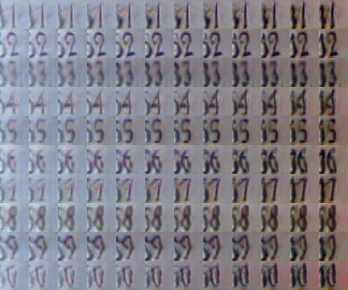
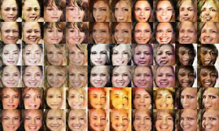
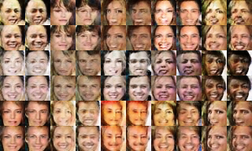

# Semi-supervised infoGAN

Official Torch Code for the paper *Guiding InfoGAN with Semi-Supervision*.

The script implements the training routine for the MNIST dataset. We used a cropped version of size 28x28 which was taken down. You can find the original MNIST dataset [here](http://yann.lecun.com/exdb/mnist/).

After cloning this repository, download the dataset into the code directory and specify the path to it in the configuration.lua file, alongside any other parameter changes you wish to have. Then execute the training procedure in train_ss-infogan.lua with
```bash
th train_ss-infogan.lua
```
If the score with respect to a classifier is required, a valid classifier must be trained. Its path can then be specified in the configuration.lua file. If none is available, the metric will not be calculated.

## Examples

### MNIST
 
### SVHN
 
### CelebA
 
### CIFAR-10


## Dependencies

```bash
luarocks install torchnet
luarocks install penlight
luarocks install nninit
luarocks install cutorch
luarocks install cunn
```

## Credits

This code is a heavily modified version of and based on the code found [here](https://github.com/anibali/infogan).

